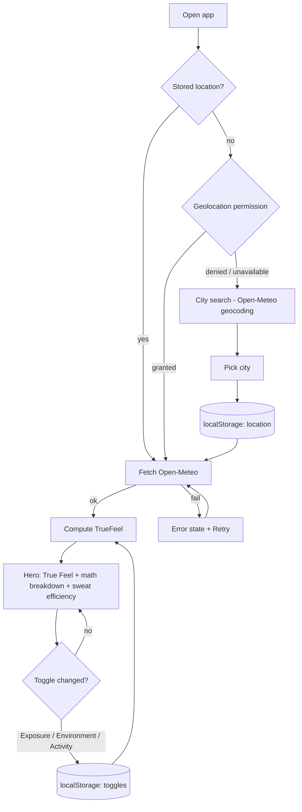
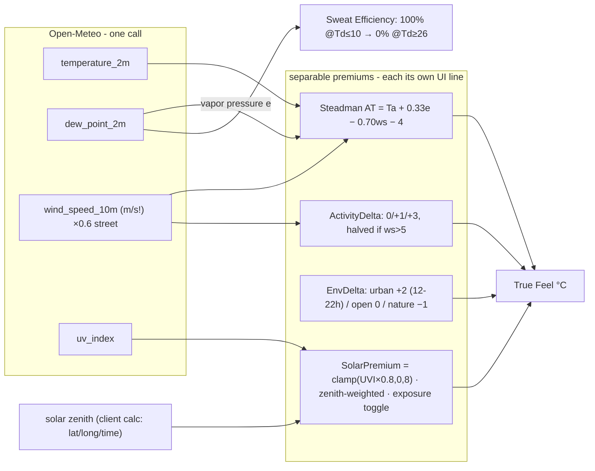
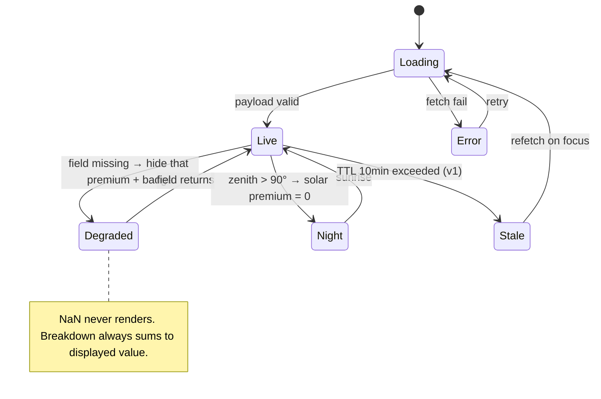
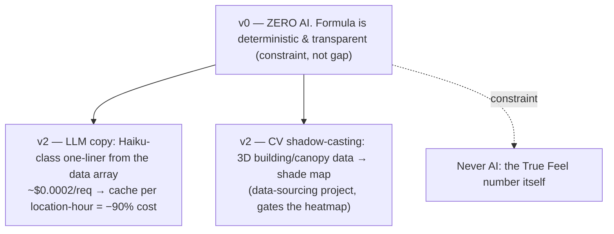
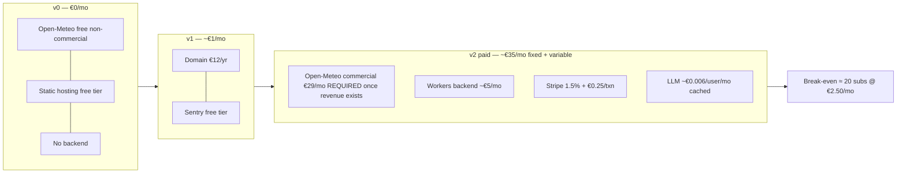
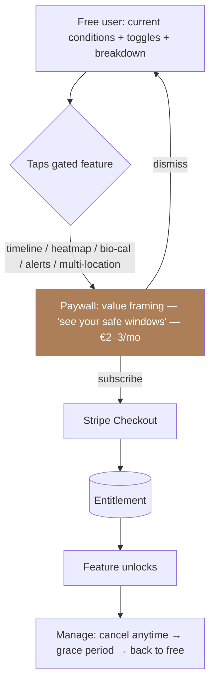
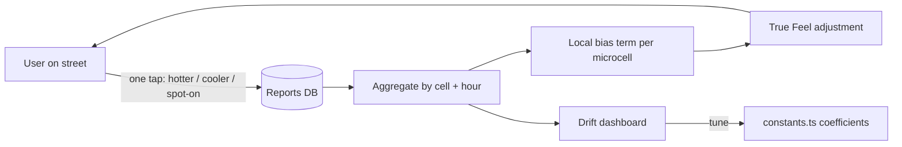

# RealTemp — System Maps

All flows, uses, AI, cost, and paywall in one doc. Source of truth for behavior; PRD.md holds the formula.

## 1. Core user flow (v0)

## 2. Formula pipeline (deterministic, no AI)

## 3. Data / degraded state machine

## 4. AI tiers — what's AI, what never is

## 5. Cost model

## 6. Paywall flow (v2, freemium)

Free tier stays genuinely useful (the differentiator — visible math — is FREE; it's the trust engine). Premium sells depth: time (timeline), space (heatmap), body (bio-cal), push (alerts).

## 7. Crowdsource validation loop (v2 — how the formula earns accuracy)

